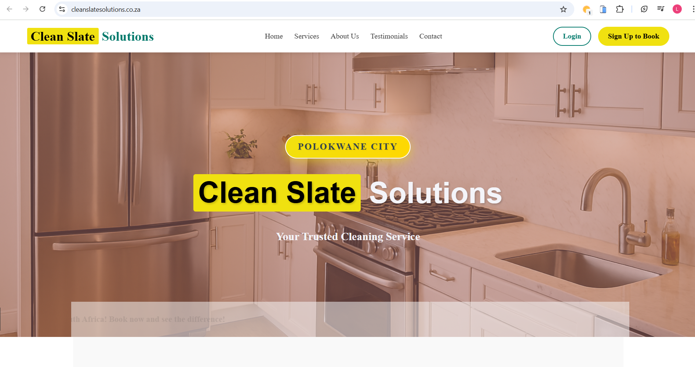

# Clean Slate Solutions — Case Study

Project: Clean Slate Solutions
Live: https://cleanslatesolutions.co.za/

Summary
-------
A professional website for Clean Slate Solutions focused on presenting services, client success stories, and contact.

Role
----
- Lead developer and UI/UX designer.
- Implemented responsive layout, content-first approach, and accessible navigation.

Tech & Architecture
-------------------
- HTML5, CSS3, vanilla JavaScript
- Responsive grid and mobile-first breakpoints
- Small, focused asset pipeline: optimized PNGs and SVG icons

Highlights
---------
- Clear information hierarchy and CTA (contact form + phone/email)
- Lightweight performance: fast first paint and under 250KB of images used on the homepage
- Accessible navigation and semantic markup

Potential improvements / next steps
----------------------------------
- Add a CMS (headless or static-site manager) for non-technical content updates
- Add analytics and performance monitoring to track user flows and conversion
- Implement A/B tests for different hero CTAs

Screenshots
-----------

