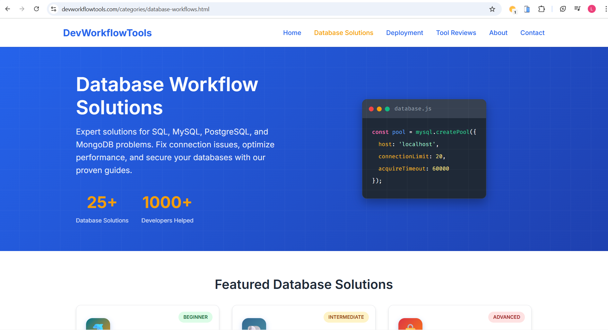

# Dev Workflow Tools — Case Study

Project: Dev Workflow Tools (devworkflowtools.com)
Live: https://devworkflowtools.com/

Summary
-------
A tools site aimed at improving developer productivity with small utilities and workflow enhancements.

Role
----
- Full-stack developer: designed front-end layouts and implemented several utility back-end scripts.

Tech & Architecture
-------------------
- HTML, CSS, JavaScript
- Modular front-end components for quick re-use across utilities
- Lightweight serverless endpoints for form handling and small data tasks

Highlights
---------
- Fast-loading pages and a clear index of tools
- Simple, approachable UI for tooling documentation
- Tools designed to be reused or embedded in other pages

Potential improvements / next steps
----------------------------------
- Convert frequently used utilities into npm packages or web components
- Add unit/integration tests for utility endpoints
- Improve discoverability with richer metadata and structured data

Screenshots
-----------

